Building a Chatroom in Python with Websockets

Table of Contents

    1.0 Introduction	
        1.1. Learning and Research	
        1.2 Decisions	
    2.0 Project Discussion	
        2.1 Local Environment Setup	
            2.1.1 Setting Up A Virtual Environment	
            2.1.2 Installing Dependencies	
        2.2 Front End	
            2.2.1 Model-View-Controller Architecture	
            2.2.2 Login View	
            2.2.2 Registration View	
            2.2.3 Chat View	
            2.2.3 Client-Side Code	
        2.3 Back End	
            2.3.1 Database	
                  Table Creation	
                  Adding Records via flask-SQLAlchemy	
            2.3.2 Back-End Code	
                   Flask Sessions	
        2.4 Deploying to Heroku	
            2.4.1 Initial Deployment
            2.4.2 Debugging Deployment Errors	
                  Requirements.txt	
                  Procfile	
                  Running but not Working: HTTP and Long-Polling	
        2.5 Future Work	
    3.0 Conclusion	
    4.0 References	

## 1. Introduction
This project was created as the final project for a Computer Networks graduate class. We studied HTTP in our class, a common protocol which requires a request from the client to fetch a response from a server. I found myself wondering about how chat rooms work; do the clients just continuously poll the server and ask for changes? That seemed wildly inefficient and I figured there must be a better way to push changes from a server which doesn’t require a specific client-side request or page refresh. 

### 1.1 Learning and Research
I looked at many tutorials in preparation of deciding how to implement a chatroom. It became clear that most chats use either Websockets (implemented over TCP) or Asynchronous Javascript and XML (AJAX) (implemented on top of HTTP) [1]. I read through all of the below tutorials (and did a few of them halfway) to see what interested me and what I thought would be achievable during this semester:
* Building your first Chat Application using Flask in 7 minutes [14]
* Building a Facebook Chat Bot with Node and Heroku [15]
* Build a Node.js Websocket Chat with React [16]
* Building a Socket.io chat app and deploying it using AWS Fargate [17]
* Socket.io Documentation Tutorial (Node.js) [18]
* Let’s Write a Chat App in Python (Python & Tkinker) [19]
* Chat Widget with Python and Javascript [20]
* Slackbot with Django [21]
* Twilio Chat with Django [22]
* Build a Chat with Node.js [23]
* Integrating WebSockets with Flask & Vue [24]

### 1.2 Decisions
Based on the tutorials above, I made the following decisions for my project:
* I would implement this chat in Python using Flask because I wanted to learn more about Python and get hands on experience with one of its web frameworks. 
* I would use Websockets because I was already familiar with the TCP protocol and wanted to acquire hands on experience using sockets.
* I would learn how to use SQL and integrate a database into my application so I could add registration and login functionality.
* I would deploy my application to Heroku. 

I fulfilled all of my projected requirements! You can visit my project live at [Heroku](https://thawing-wave-13777.herokuapp.com/). If you want to make two accounts and test the chat functionality, you will need to use two different browsers (or, if using Chrome, you can have one normal tab open and open one tab open in incognito mode.)

## 2. Project Discussion
### 2.1 Local Environment Setup
#### 2.1.1 Virtual Environments

Before starting my project I learned about the benefits of creating virtual environments. Virtual environments are incredibly helpful in order to manage having multiple projects on one machine, since each project may be built with varying installation requirements [2]. I created a virtual environment using virtualenv [3] by running the following command in my terminal:

     $ virtualenv -p python3 venv

Then, every time I worked on my project from the command line, I first ran this command to activate my virtual environment:

     $ source venv/bin/activate

This virtual environment allows me to run my projects independently of other project dependencies on my computer. This means that if this current project gets built for Flask version X but my next project runs Flask version Y, I can have both projects (and both versions of Flask!) run on my computer without conflicting with each other.

#### 2.1.2 Installing Dependencies
I started with installing Flask, a Python web framework - since that was the first thing I knew I needed to learn. For the chat functionality I used Websockets which creates a a long-held TCP connection between a client and server and allows for bi-directional, full duplex communication [4] without the need of a page refresh as is the case with HTTP. I used a Python library called Flask-Socketio to integrates Flask and Websockets together [5]. Finally I installed Eventlet, which is a networking library that Socketio prefers to use [6]. 

I used a PostgreSQL database hosted by Heroku [7] to handle user login and registration. I installed SQLAlchemy to use this database with Python and then flask_sqlalchemy to integrate SQLAlchemy and Flask.

All of these items were installed by running the command:

     $ pip install [name of item]

These installations came with their own dependencies which were installed automatically during their own installation. I learned that I could create a text file that showed all of my project’s dependencies by running the command:

     $ pip freeze > requirements.txt

Other than just being good to have this list of dependencies, this text file was also required for deployment to Heroku.
### 2.2 Front End
#### 2.2.1 Model-View-Controller Architecture
Flask uses a Model-View-Controller (MVC) architectural pattern, which means that logic is split into three main categories:

##### Views
Views can be thought of as pages that are seen by the client. My application has three views: a login view, a registration view, and a chat view. These views both present data to the client and also allow the client to input data to be passed to the server.

##### Controllers
Controllers take input from the client via the views and makes decisions about which view to present the client with next. It often does this by sending the input to a model to “do something with.” 

##### Models
Models hold the logic and "rules" of the application. In my application, I only needed a model for the database structure.
#### 2.2.2 Login View
When the user comes to the homepage for the first time, they are presented with a login view [Figure 1]. If they try to submit the page without having both username and password filled in, they are given an error by CSS form validation and the form does not submit [Figure 2]. Once they enter both a username and a password, the form will submit successfully, and the data is sent to the server. A call is then made to the Postgre database and the username and password are checked for a match. If there is no match, the user is returned to the login page with an “invalid credentials” message [Figure 3].

| 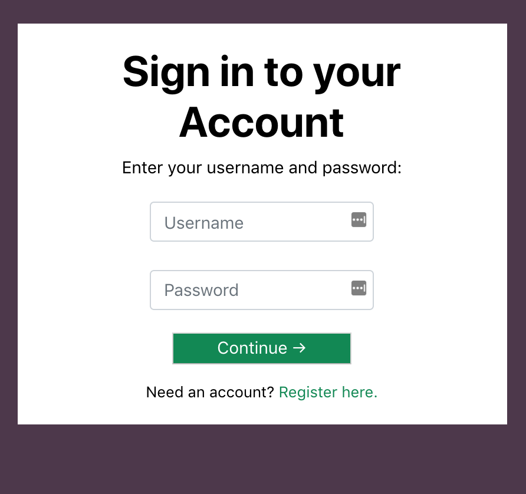 |
| :-----------------------------------------:|
|Figure 1: Login View|

|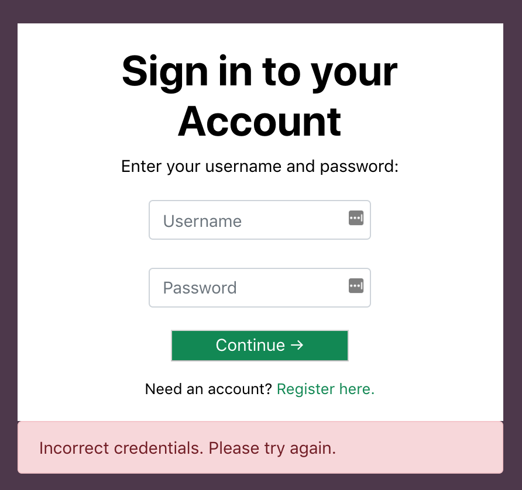 |
| :-----------------------------------------:|
| Figure 2: Login failure due to incorrect username or password |

|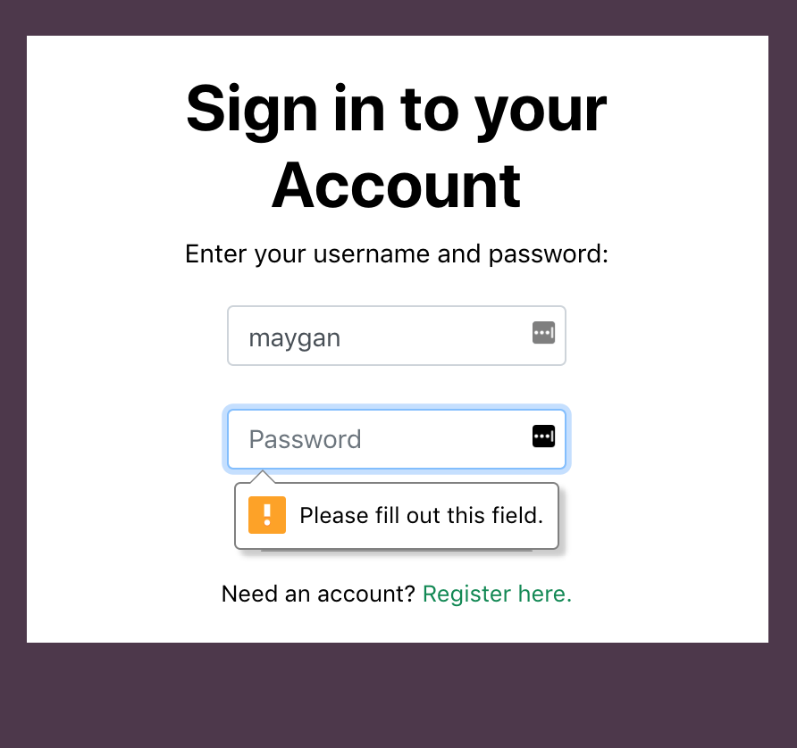 |
| :-----------------------------------------:|
| Figure 3: Form validation with Bootstrap (CSS) |

If there is a match for their username and password in the database, they are presented with the chat view and a TCP Websocket connection is opened between the browser and the server.

#### 2.2.2 Registration View
A first time user also has the option to create an account by clicking on the “Register here” link on the login page [Figure 4]. There the user is asked for a display name, a username, and a password. All three fields must be filled out before the user can submit the form. 

Upon submission, there is a call to the database to check if the username or display name already exists and if either exists in the database already, the user is kicked back to the registration page with an error indicating which credential did not fulfill the uniqueness requirement. [Figure 5]

|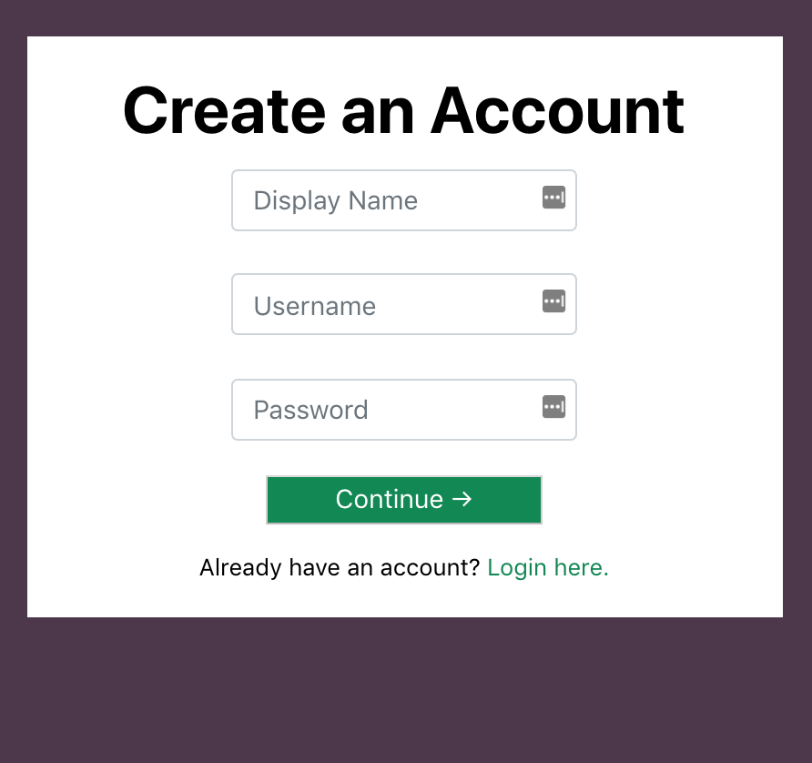 |
| :-----------------------------------------:|
| Figure 4: Registration View |

|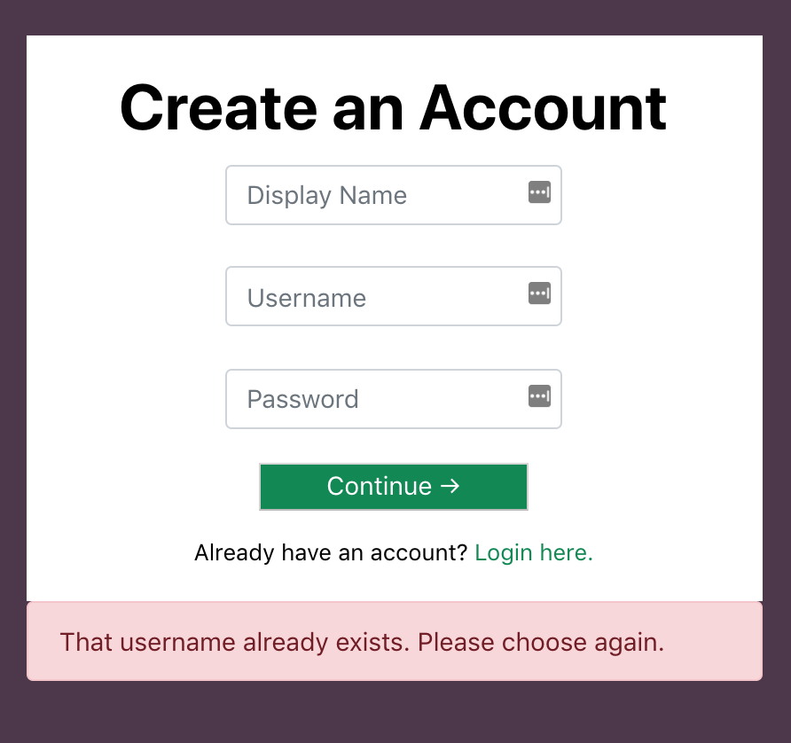 |
| :-----------------------------------------:|
| Figure 5: Registration failure due to username already existing in the database|

If the credentials are unique, they are assigned a random avatar which is added to their record, their information is added to the database for future login, and the user is routed to the chat page.

#### 2.2.3 Chat View
On the chat page, the user sees a simple “Hello, <<displayname>>” message above an empty box for chat messages [Figure 6]. On the right side of the page is a “Users Online” box which holds display names and avatars for all users with active TCP connection. When another user joins the page, a connection event is broadcast to all other users, the user’s name and avatar are added to the “Online Users” div, and a message appears stating that the user has joined [Figure 7].

|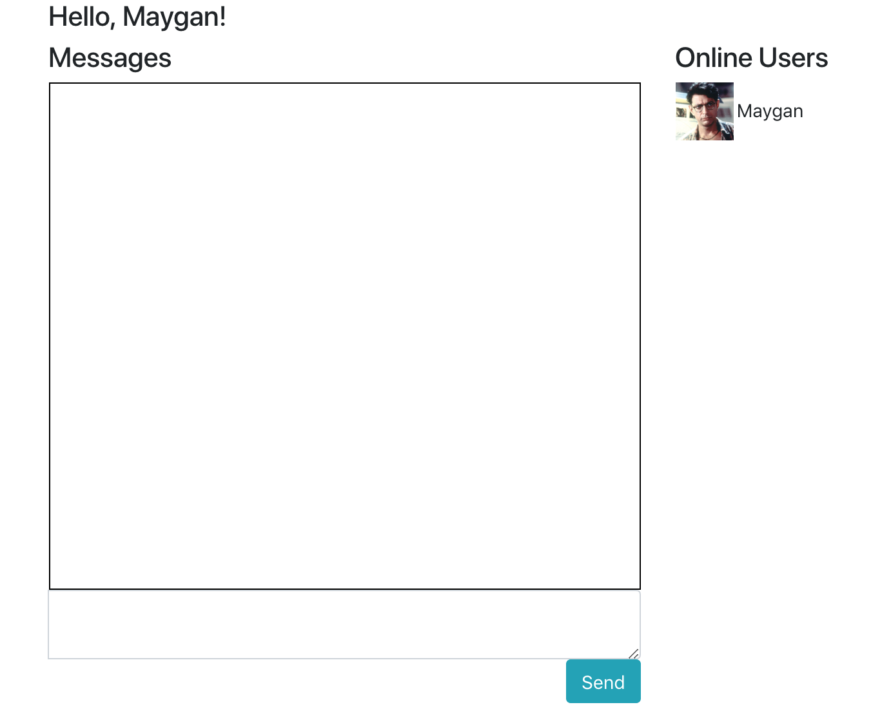 |
| :-----------------------------------------:|
| Figure 6: Chat view with  one user online |

|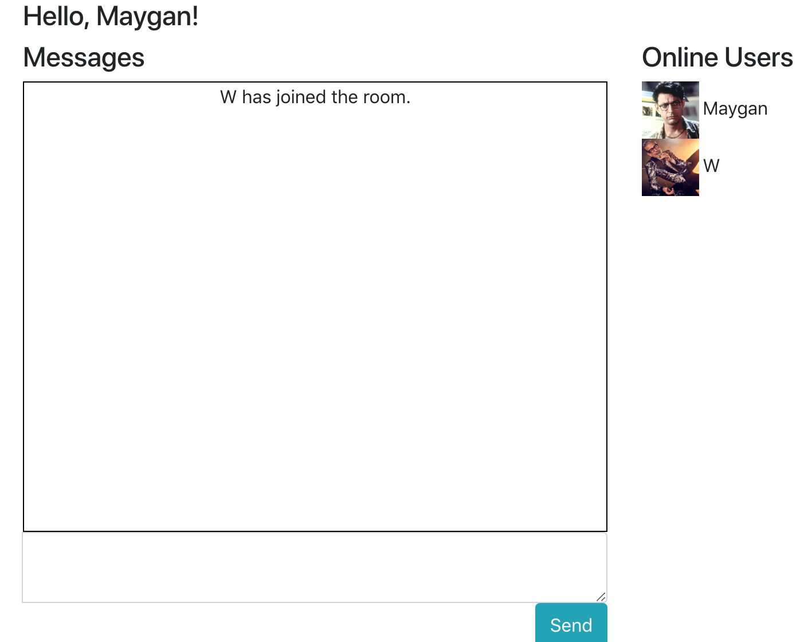 |
| :-----------------------------------------:|
|Figure 7: Chat view when a second user joins |

When a user types a message into the textarea, they can either press the “Send” button or simply press Return on their keyboard to submit the form, which pushes their messages to the server [Figure 8].

| |
| :-----------------------------------------:|
|Figure 7: Chat view when a second user joins |

|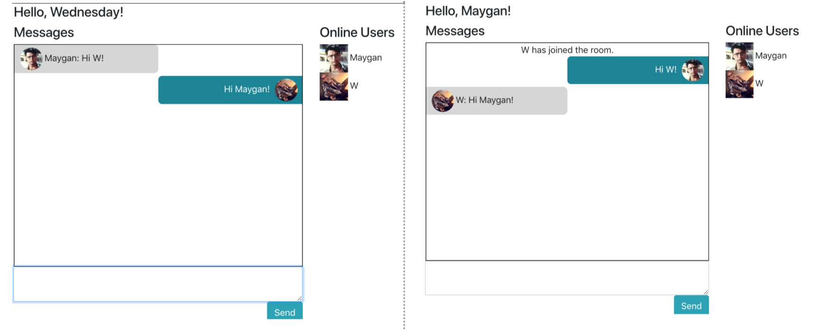 |
| :-----------------------------------------:|
|Figure 8: Two users chatting, shown from each of their views |

Finally, when a user disconnects (leaves the webpage), this is noticed by the server who alerts the rest of the online users. The user who left is removed from the “online users” div of the remaining clients and a notification is displayed in the Messages div [Figure 9].

| |
| :-----------------------------------------:|
|Figure 9: When a user leaves the room, a message is displayed to other users and the user is removed from Online Users div. |

#### 2.2.3 Client-Side Code
The views were created using HTML, CSS, Bootstrap (a CSS library) [8], Jinja2 (a “templating language” utilized by Flask) [9], and Javascript. 

The client-side Websockets functionality is implemented with Javascript and uses the Javascript socket.io library which is imported in the HTML header of the chat page [10]. These sockets are always listening for a `socketio.emit` function from the server. When they receive one with an argument that matches an existing client-side `socket.on()`  function’s argument, the corresponding code is ran. 

For example, when a user sends a message, it is emitted to the server via a `socket.emit` function from the client. The server receives this message and runs `socketio.emit(“incoming message”)` which is sent to all of the connected clients, who each run their own `socket.on(“incoming message”)` functions. This function adds the received message to each of their messages divs, with a different CSS class if the sender of the message was themselves. 

This same process of (1) a user emitting data to the server, (2) that data being sent to all of the clients, and (3) the clients running some action as a result also happens when a user connects and when a user disconnects.

I also wrote a few Javascript functions to accomplish things small like adding an Event Listener so pressing the Return key submits the chat message, not allowing the user to submit an empty chat message, and scrolling the messages-div automatically when it overflows from new messages.

### 2.3 Back End
#### 2.3.1 Database
I used a free PostgreSQL Database from Heroku. This was my first time using databases so my database design went through a few iterations, which I describe below.
##### Table Creation
I knew that I wanted my users table to hold the following data: usernames, passwords, display names, and avatar (a number from 1-15 which would determine which avatar picture got assigned to a user profile).  

I first created an SQL table that contained columns for a unique user_id, a unique username, and password [Figure 10]. I realized that I had forgotten to add columns for display name or avatar choice, so I ran another command to add columns to the (now) existing table [Figure 11]. Finally, I then decided to change the name of avatar_choice to simply avatar, so I ran one final command to change the name of the column [Figure 12]. This experience made me realize how important it is to be deliberate when planning and creating models/tables, but I am also glad that I got the experience of writing multiple SQL statements for different cases.

|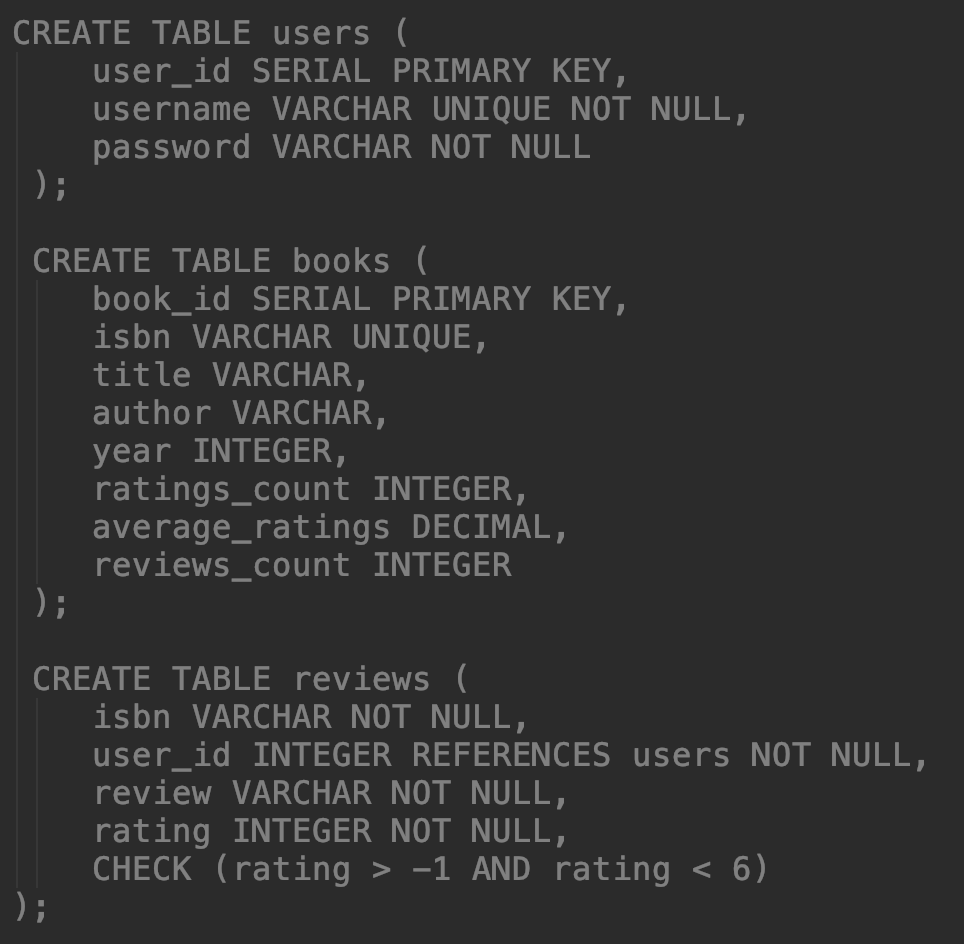|
| :-----------------------------------------:|
| Figure 10: Original table creation|

|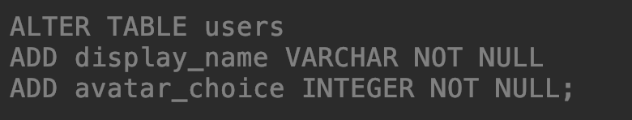|
| :-----------------------------------------:|
| Figure 11: Adding columns to an existing table |

||
| :-----------------------------------------:|
| Figure 12: Changing a column name |

##### Adding Records via flask-SQLAlchemy
Mostly the database is used for querying - in the case when a user wants to login and the database is checked for their username and password - but the registration function requires the ability to actual adding records to the database too.

At first I had SQL commands written straight into my Python code with variables where user input would go (the variables are validated automatically by SQLAlchemy in order to avoid SQL injections) [FIGURE 13]

|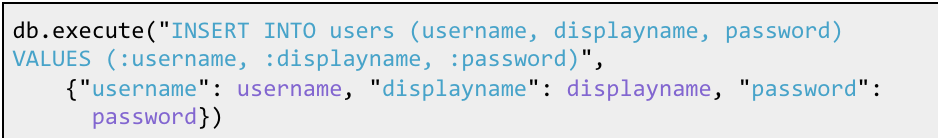|
| :-----------------------------------------:|
| Figure 13: SQL commands written into Python code, with SQL-Alchemy validation |

But this obviously isn’t very nice to read, or maintainable for that matter. So instead I used SQLAlchemy’s Object Relational Mapping (ORM) capabilities to make a model for a generic user and therefore get rid of the need to write SQL into my Python files [Figure 14].

|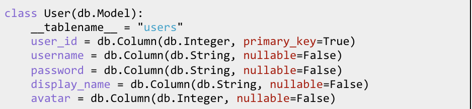|
| :-----------------------------------------:|
| 
Figure 13: Using SQLAlchemy’s ORM capabilities to create a User model|

Then when I a user wanted to register I could make a new User object and add it to the database without any SQL statements, as shown in [Figure 15].

|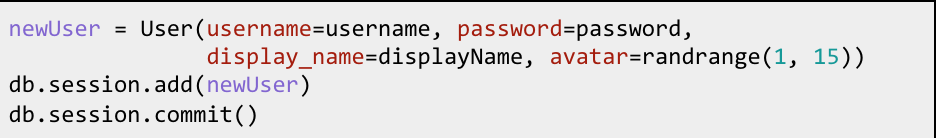|
| :-----------------------------------------:|
| Figure 15: Adding a new user to the database using the User object |

This is much cleaner and more manageable than having SQL statements written directly into my Python code.

#### 2.3.2 	Back-End Code
As mentioned earlier, my application’s server is always-on and waiting for communication from the clients. Flask serves views to clients by using route decorators to determine what function should run based on what URL the client is on. 

For example, when one of my users is sent to the URL “/login”, the view “login.html” is served to them [Figure 16]. 

||
| :-----------------------------------------:|
| Figure 16: Example of a simple route in Flask |

When they submit the login form on that page, they are routed to the “/” URL which runs the index() function and checks if the user entered correct login credentials. If they did, they are rendered the chat view, otherwise they are routed back to the login view with an error message [Figure 17]

|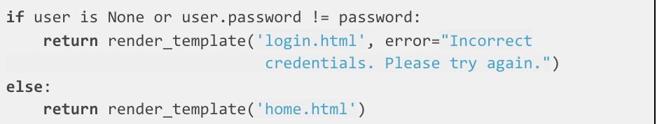|
| :-----------------------------------------:|
| Figure 17: Example of a how a controller decides what view to present to user |

Flask relies on page refreshes to route users and make changes to views. When a user is actually in the chatroom, Websockets needed to be implemented to avoid these refreshes, and this was done through the flask-Socketio library. Socketio events are very similar to route events, but they listen for socket events instead of URLs and are marked with @socketio.on decorators instead of @app.route decorators [Figure 18].

|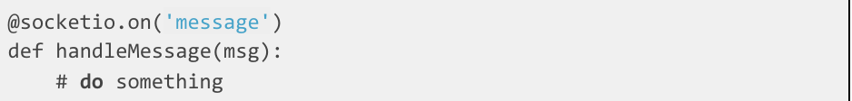|
| :-----------------------------------------:|
| Figure 18: Example of a Socketio event |

##### Flask Sessions
I quickly ran into the problem of how to know which user sent a socket event, since the only thing sent via the client-side form is the chat message itself. I quickly discovered that Flask has built in functionality called Sessions exactly for the purpose of differentiating between online users. Sessions is effectively a Python dictionary that can be populated with key/values which lives in the cookies of the client’s browser and follows the user throughout their time on the Flask application. Any information saved in the Session cookie can be passed back and forth between client and server. 

When a user successfully logged, I added their displayName, username, userID, and avatar to their Session. When a user sent a message to the server, the server emits out to all users both the message and also the value in the sender’s Session[‘username’]. 

Sessions were useful but also proved to be problematic. They are stored in the cookies of the browser and made it so that I could not open two tabs with two different users logged in. They also proved difficult to clear.

### 2.4 Deploying to Heroku
#### 2.4.1 Initial Deployment 
Deploying to Heroku was a new experience for me but I learned a lot in this process. Unfortunately Heroku’s instructions for deploying a Python web application are geared towards Django instead of Flask and thus were not very helpful for me [11]. 

When I logged into my Heroku account and clicked on this project, there was a link for “deploy” which contained command line instructions that I followed [Figure 19]. 

|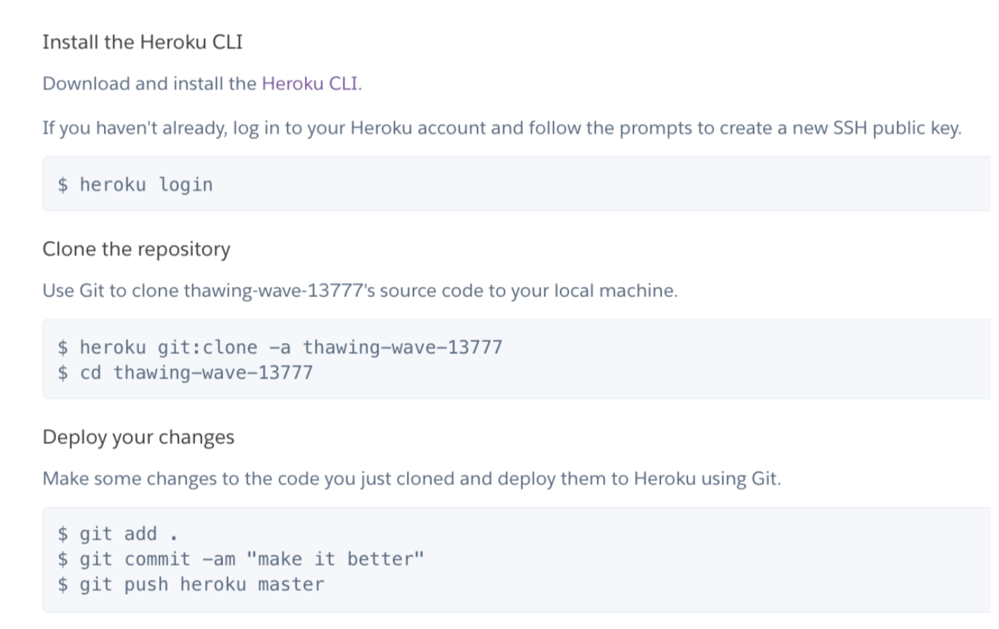|
| :-----------------------------------------:|
| Figure 19: Heroku’s Command Line instructions for deploying via Git |

#### 2.4.2 Debugging Deployment Errors
Unfortunately my application did not work upon first deployment; when I went to my application’s Heroku website I got an error message that my application had crashed.  I would receive this error message many times and eventually determined that I needed to fulfill all of the following requirements before my application would run:

##### Requirements.txt
As stated earlier in this paper, a requirements.txt file is necessary in order to tell Heroku what dependencies my application requires in order to run. It must be completely up to date with the project.

##### Procfile
A procfile is a file that is required for Heroku web application projects to successfully run. Heroku’s documentation says that a Procfile has text “that specifies the commands that are executed by the app on startup” [12]. I included a file in my project named Procfile with the following command:

    web: gunicorn -k eventlet app:app 

This command told Heroku to start a web process on a gunicorn server utilizing the eventlet library and look for a file named app to use as the main application.

##### Running but not Working: HTTP and Long-Polling
After fixing the above requirements, my application actually ran on Heroku! However, I still had problems with the Websockets functionality. 

At first my application would work until the user logged in, then it would unexpectedly crash when trying to load the actual chatroom. A look at the Heroku command line error log showed me the following error:  "Error in connection establishment: net::ERR_NAME_NOT_RESOLVED.” I discovered that this was due to me initializing the client-side socket over http instead of https. 

Once I fixed this and my chat actually loaded, the actual chat functionality didn’t work. I was getting a recurring “Error during WebSocket handshake: Unexpected response code: 400" in my Chrome Developers Console, and when I looked into the Networks tab of the Developers Console I saw a lot of indicators that my applications was “polling,” which was not an expected behavior for an application that should have been using a persistent TCP connection. I learned that I needed to explicitly state in my client-side code that the transport should be over Websockets (otherwise the library defaults to long-polling which is not supported by my server’s Socket-io library). [13] 

Both of these errors were fixed with changes to one line of client-side Javascript [Figure 20].

|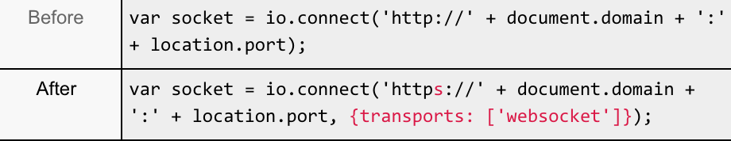|
| :-----------------------------------------:|
| Figure 20: Client-side socket initialization changes - from HTTP to HTTPS and long-polling to websockets |

### UPDATE: March 11th, 2019
Heroku deleted my database because it hadn't been used recently, so I spent some time recreating it and redeploying my app.

I also decided to remove configuration variables such as the Database URL and Secret Key.

    $ cd myapp
    $ heroku config:set SQLACHEMY_DATABASE_URI='<postgres url>' SQLALCHEMY_TRACK_MODIFICATIONS=False SECRET_KEY='<secret_key>'
    

### 2.5 Future Work
I would still like to fulfill the following:
* Currently the application gets confused if the same user logs in twice or opens more than one tab and behavior can be unexpected. I would like to make it so that the user can have more than one tab open and each tab will be logged in to the same profile, without duplicating their arrival messages.
* Add logout button for user
* Add the ability to create private rooms and/or private chats between users

## 3. Conclusion
This project was a great learning experience for me. I learned about how to implement Websockets over a TCP connection; how to make a Flask application; create, use and integrate a SQL database; and deploy an application to Heroku. I also continued working on my front end development skills and got more practice with HTML, CSS, Bootstrap, Javascript, and Jquery. 

## References
[1] “Getting Started,” MDN Web Docs. [Online]. Available: https://developer.mozilla.org/en-US/docs/Web/Guide/AJAX/Getting_Started. [Accessed: 17-Dec-2018].

[2] Real Python, “Python Virtual Environments: A Primer – Real Python,” Real Python, 07-Aug-2018. [Online]. Available: https://realpython.com/python-virtual-environments-a-primer/. [Accessed: 17-Dec-2018].

[3] “venv - Creation of virtual environments¶,” 16.2. threading - Higher-level threading interface - Python 2.7.15 documentation. [Online]. Available: https://docs.python.org/3/library/venv.html. [Accessed: 17-Dec-2018].

[4] “What are WebSockets?,” Pusher. [Online]. Available: https://pusher.com/websockets. [Accessed: 17-Dec-2018].

[5] “Welcome to Flask-SocketIO's documentation!,” Welcome to Flask-SocketIO's documentation! - Flask-SocketIO documentation. [Online]. Available: https://flask-socketio.readthedocs.io/en/latest/. [Accessed: 17-Dec-2018].

[6] “Eventlet,” Eventlet Networking Library. [Online]. Available: http://eventlet.net/. [Accessed: 17-Dec-2018].

[7] “Heroku Postgres,” Cloud Application Platform. [Online]. Available: https://www.heroku.com/postgres. [Accessed: 17-Dec-2018].

[8] M. Otto and J. Thornton, “CSS,” · Bootstrap. [Online]. Available: https://getbootstrap.com/docs/3.3/css/. [Accessed: 17-Dec-2018].

[9] “Welcome to Jinja2,” Welcome | Jinja2 (The Python Template Engine). [Online]. Available: http://jinja.pocoo.org/docs/2.10/. [Accessed: 17-Dec-2018].

[10] “Socket.IO,” Socket.IO, 01-Aug-2018. [Online]. Available: https://socket.io/. [Accessed: 17-Dec-2018].

[11] “Getting Started on Heroku with Python,” Deploying Python Applications with Gunicorn | Heroku Dev Center. [Online]. Available: https://devcenter.heroku.com/articles/getting-started-with-python. [Accessed: 17-Dec-2018].

[12] “Categories,” Deploying Python Applications with Gunicorn | Heroku Dev Center. [Online]. Available: https://devcenter.heroku.com/articles/procfile. [Accessed: 17-Dec-2018].

[13] “WebSocket connection failed: Error during WebSocket handshake: Unexpected response code: 400,” Stack Overflow. [Online]. Available: https://stackoverflow.com/questions/41381444/websocket-connection-failed-error-during-websocket-handshake-unexpected-respon. [Accessed: 17-Dec-2018].

[14] S. Alla, “Building your first Chat Application using Flask in 7 minutes,” codeburst, 26-May-2018. [Online]. Available: https://codeburst.io/building-your-first-chat-application-using-flask-in-7-minutes-f98de4adfa5d. [Accessed: 17-Dec-2018].

[15] J. Echessa, “Building a Facebook Chat Bot with Node and Heroku,” SitePoint, 29-May-2018. [Online]. Available: https://www.sitepoint.com/building-facebook-chat-bot-node-heroku/. [Accessed: 17-Dec-2018].

[16] “Building a Node.js WebSocket Chat App with Socket.io and React,” ITNEXT, 22-Feb-2018. [Online]. Available:https://itnext.io/building-a-node-js-websocket-chat-app-with-socket-io-and-react-473a0686d1e1. [Accessed: 17-Dec-2018].

[17] N. Peck, “Building a Socket.io chat app and deploying it using AWS Fargate,” medium.com, 01-Feb-2018. [Online]. Available: https://medium.com/containers-on-aws/building-a-socket-io-chat-app-and-deploying-it-using-aws-fargate-86fd7cbce13f. [Accessed: 17-Dec-2018].

[18] “Chat,” Socket.IO, 31-Oct-2018. [Online]. Available: https://socket.io/get-started/chat. [Accessed: 17-Dec-2018].

[19] S. Chaturvedi, “Let's Write a Chat App in Python – The Startup – Medium,” medium.com, 22-Nov-2017. [Online]. Available: https://medium.com/swlh/lets-write-a-chat-app-in-python-f6783a9ac170. [Accessed: 17-Dec-2018].

[20] “Build a chat widget with Python and JavaScript,” Pusher, 23-Jul-2018. [Online]. Available: https://pusher.com/tutorials/chat-widget-python. [Accessed: 17-Dec-2018].

[21] Anaek, “Slack Bot With a Django Backend - 101 Tutorial – Chatbots Magazine,” Chatbots Magazine, 16-Aug-2016. [Online]. Available: https://chatbotsmagazine.com/slack-bot-with-a-django-backend-101-tutorial-c1aa8ea3f15e. [Accessed: 17-Dec-2018].

[22] K. Ndung, “How to Build Chat into Django Applications with Twilio Programmable Chat,” Messaging - Twilio, 04-Sep-2018. [Online]. Available: https://www.twilio.com/blog/2018/05/build-chat-python-django-applications-programmable-chat.html. [Accessed: 17-Dec-2018].

[23] R. Sayar, “Build a Node.js-powered Chatroom Web App: Getting Started,” SitePoint, 29-May-2018. [Online]. Available: https://www.sitepoint.com/build-node-js-powered-chatroom-web-app-getting-started/. [Accessed: 17-Dec-2018].

[24] “Weekend Project (Part 4): Integrating Websockets into a Real-Time Vue App with Socket.io and Vuex,” SecDevOps, 23-Apr-2018. [Online]. Available: https://secdevops.ai/weekend-project-part-4-integrating-websockets-into-a-real-time-vue-app-with-socket-io-and-vuex-e358e04f477c. [Accessed: 17-Dec-2018].

